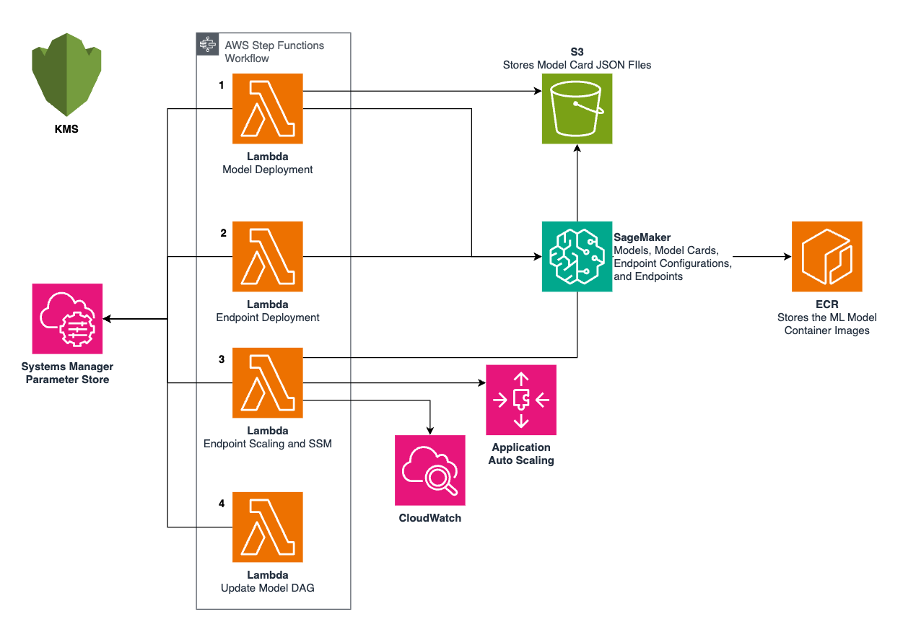

# Amazon SageMaker AI Model and Endpoint Deployment Pipeline with AWS Step Functions

## Description
Simplify your machine learning workflow with this AWS Step Functions State Machine. Deploy SageMaker AI Models and Endpoints effortlessly, without the need for SageMaker AI Studio. Key features include:

Version control: Preserve your model history using SageMaker AI Model Cards

Flexibility: Support for multi-container SageMaker AI Models and dependent ML models (also known as inference pipelines), as well as real-time and asynchronous SageMaker AI Endpoints

Streamlined invocation: Leverage Systems Manager Parameters to call your SageMaker AI models in the correct order for your Inference Pipeline

This solution empowers developers to manage their entire ML deployment process through a single, automated workflow. By eliminating manual steps and providing a consistent deployment pattern, you can accelerate your path from experimentation to production.

## Visuals

- Model Deployment Task: Deploys SageMaker AI Models and Model Cards
- Endpoint Deployment Task: Deploys SageMaker AI Endpoints and Endpoint Configurations
- Endpoint Scaling and SSM Task: Updates SageMaker AI Endpoint Scaling, and creates SSM Parameters for the Endpoints
- Update Model DAG Task: Updates the Model DAG (adds or removes parameters from SSM)

## Installation
1. Clone the repo and ensure the correct packages are installed
2. An AWS Account is required
3. Update the Model Containers JSON File in state_machine_input/model_containers.json.
    - This will store all of the information about your SageMaker AI Models and SageMaker AI Endpoints
4. Add your Model Card JSON Files to the model_card_json_files folder

## Usage
1. Deploy CDK Resources:
    - Begin by deploying the AWS CDK (Cloud Development Kit) resources to your AWS account. This sets up the necessary infrastructure for the subsequent steps.
    - Configure your AWS Account in the CDK Stack, or through environment variables
    - In the root directory of this project, run cdk synth followed by cdk deploy
2. Run Model Deployment State Machine:
    - After deploying the CDK resources, execute the Model Deployment Step Functions State Machine. This will create the SageMaker AI Models and endpoints for you.
3. Run Inference:
    - Once the model deployment is complete, you can start running inference using the newly created SageMaker AI endpoints.

## Support
For help, reference this [APG](https://apg-library.amazonaws.com/content-viewer/312fd448-88b1-4258-8688-e1c396ee8d5f) or use AWS Documentation [here](https://docs.aws.amazon.com/)

## Authors and acknowledgment
Anna Heltz, heltzan@amazon.com
Jack Tanny, johtanny@amazon.com

## Security

See [CONTRIBUTING](CONTRIBUTING.md#security-issue-notifications) for more information.

## License

This library is licensed under the MIT-0 License. See the LICENSE file.

